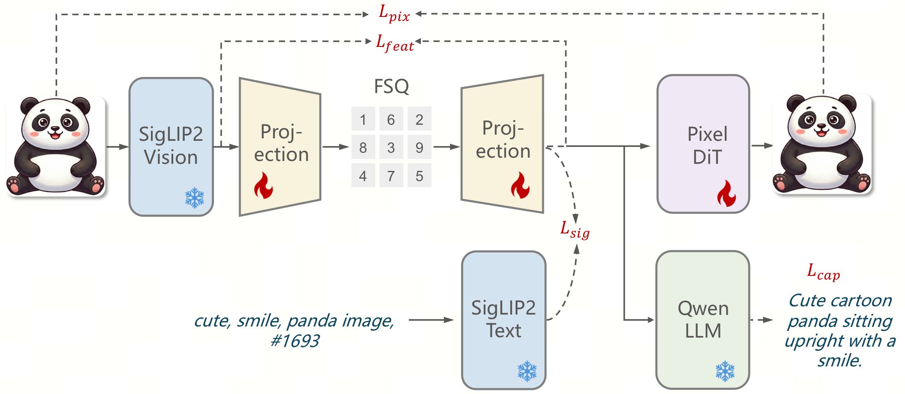
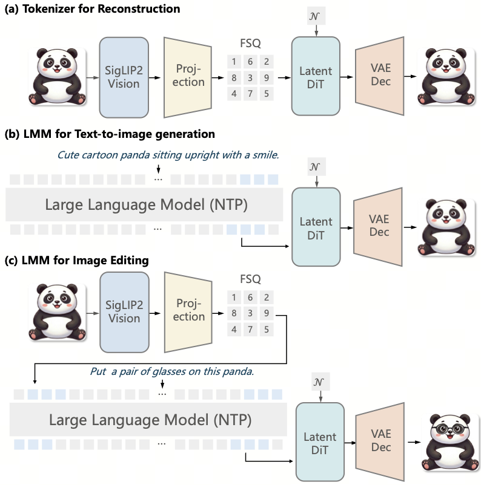
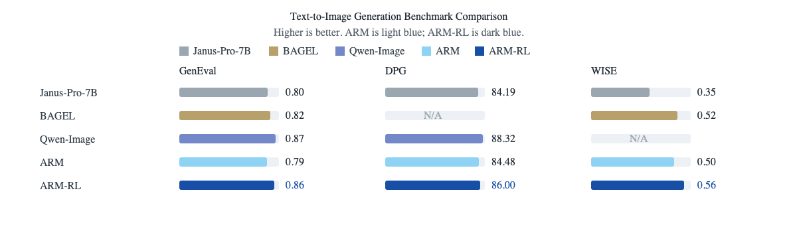
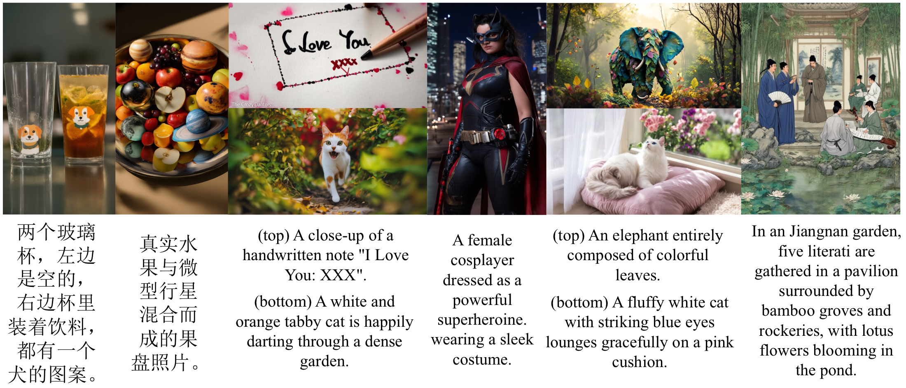
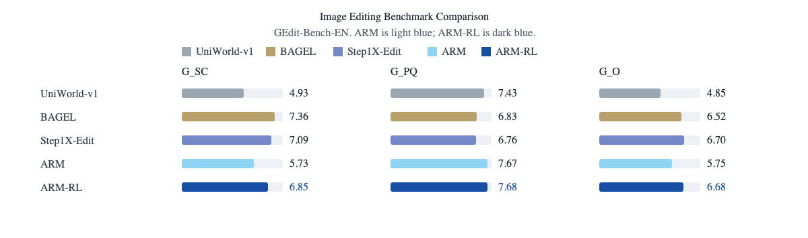
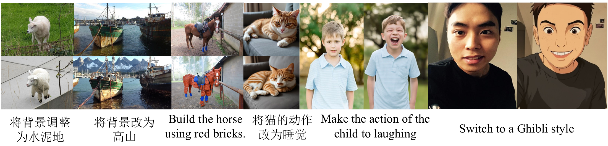
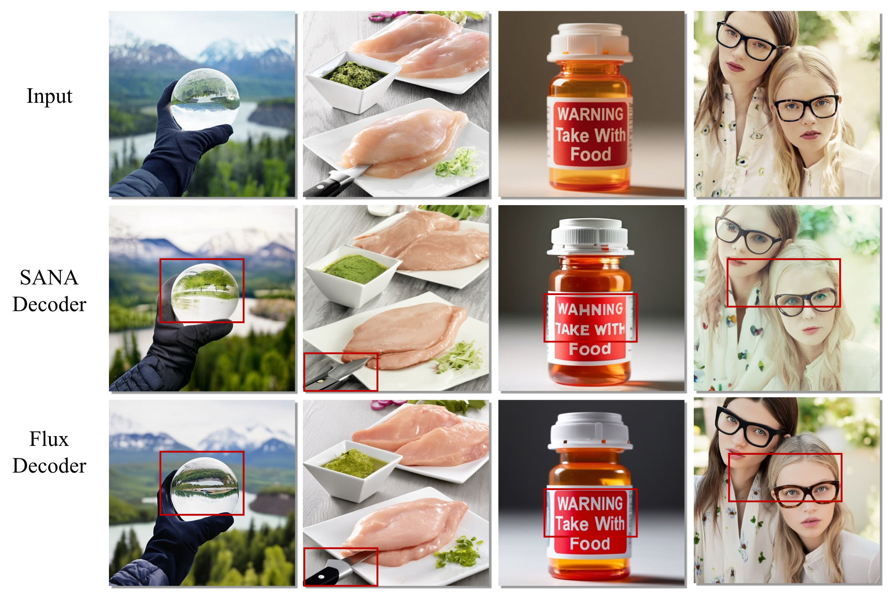
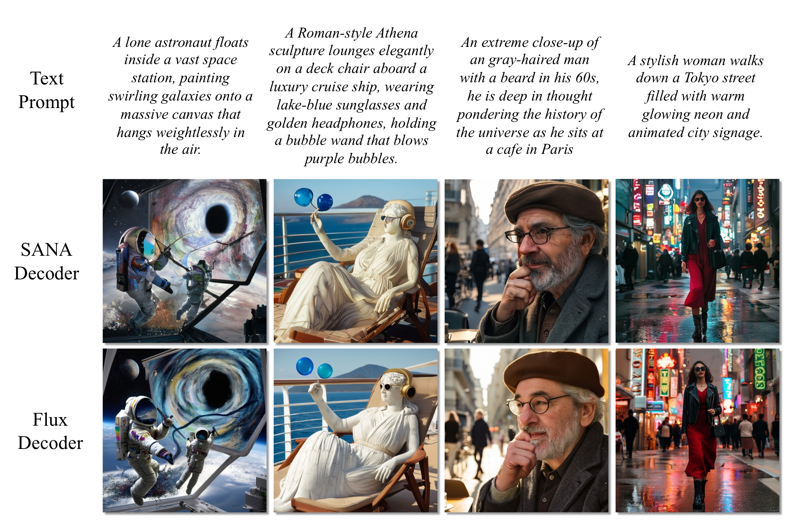
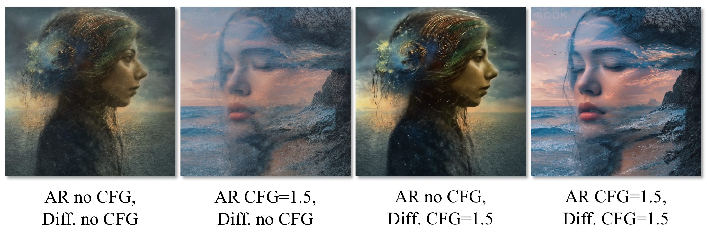

# ARM: An AutoRegressive Large Multimodal Model with Discrete Visual Representations

<p align="left">
	
	&nbsp;
	
</p>

Junke Wang*, Xiao Wang*, Jiacheng Pan*, Xuefeng Hu*, Feng Li, Jingxiang Sun, Chaorui Deng, Zilong Chen, Yunpeng Chen, Kaibin Tian, Matthew Gwilliam, Hao Chen, Danhui Guan, Kun Xu, Weilin Huang, Zuxuan Wu<sup>†</sup>, Haoqi Fan<sup>†</sup>, Yu-Gang Jiang<sup>†</sup>, Zhenheng Yang<sup>†</sup>

<small><em>* Equal contribution. † Corresponding authors.</em></small>

## News

- Paper released, please stay tuned for more updates!
- If you are interested in discussions, collaborations or related opportunities, please reach out through jkwang0724@gmail.com.

## Highlights

**ARM** is a unified autoregressive multimodal model that represents images as discrete tokens. It formulates image understanding, text-to-image generation, and instruction-guided editing with next-token prediction.

- 🌟 **Unified discrete visual representation:** shared visual token space supports understanding, generation, and editing.
- 🍺 **Pure autoregressive multimodal modeling:** standard next-token prediction on interleaved multimodal tokens.
- 🔥 **Effective RL for visual token prediction:** preference optimization improves generation and editing significantly.

<p align="center">
	
</p>

## Overview

### Unified Visual Tokenizer

ARM first learns a semantic visual tokenizer that maps images into compact discrete tokens. It is supervised with complementary losses to develop strong semantics while preserving details.

<p align="center">
	
</p>

### Unified Autoregressive Model

Based on the above tokenizer, ARM packs multimodal inputs and outputs as 1D token sequences. A single autoregressive model then performs image understanding, text-to-image generation, and image editing through next-multimodal-token prediction.

<p align="center">
	
</p>

## Results

### 1. Text-to-Image Generation

ARM achieves state-of-the-art performance among unified autoregressive models, reaching competitive results against leading image generation systems across GenEval, DPG, and WISE.

<p align="center">
	
</p>

<p align="center">
	
</p>

### 2. Image Editing

Suprisingly, RL brings a substantial improvement for image editing, raising the GEdit-Bench-EN overall score from 5.75 to 6.68.

<p align="center">
	
</p>

<p align="center">
	
</p>

### 3. Image Understanding

ARM achieves the best overall performance among models based on discrete visual representations.

| Model | POPE | MMB | MME-Perception | MMMU | GQA | VQAv2 | SEED |
| --- | ---: | ---: | ---: | ---: | ---: | ---: | ---: |
| LWM | 75.2 | - | - | - | 44.8 | 55.8 | - |
| Chameleon | - | - | - | 22.4 | - | 69.6 | - |
| Show-o | 80.0 | - | 1097 | 26.7 | 58.0 | 69.4 | - |
| Liquid | 83.2 | - | 1448 | - | 61.1 | 76.8 | - |
| VILA-U | 85.8 | - | 1402 | - | 60.8 | 79.4 | 59.0 |
| UniTok | 83.2 | - | 1448 | - | 61.1 | 76.8 | - |
| Emu3 | 85.2 | 58.5 | - | 31.6 | 60.3 | 75.1 | 68.2 |
| **ARM** | **87.3** | **80.7** | **1463** | **40.2** | 59.8 | 76.1 | **73.1** |

## Findings

### 👉 Autoregressive Model Generates, Diffusion Model Renders

The visual tokens of ARM carry the high-level semantics, layout, and much of the visual detail. With the same visual tokens, different diffusion decoders reconstruct similar images, suggesting that the autoregressive model determines the content while the diffusion decoder mainly renders pixels.

For image reconstruction, different diffusion decoders recover highly similar content from the same visual tokens, indicating that the tokens already encode most semantic and structural information.

<p align="center">
	
</p>

For text-to-image generation, the autoregressive model predicts the visual tokens that determine layout and composition, while the diffusion decoder mainly affects pixel-level rendering quality.

<p align="center">
	
</p>

### 👉 Semantic Tokens Reduce the Need for CFG

Since our visual tokens are already aligned with language, generation remains coherent even with weak or disabled classifier-free guidance. CFG mainly improves local smoothness and suppresses small artifacts.

<p align="center">
	
</p>

## Citation

If you find ARM helpful for your research, please consider starring this repository and citing our work. 

```bibtex
@misc{wang2026arm,
	title  = {ARM: An AutoRegressive Large Multimodal Model with Unified Discrete Representations},
	author = {Wang, Junke and Wang, Xiao and Pan, Jiacheng and Hu, Xuefeng and Li, Feng and Sun, Jingxiang and Deng, Chaorui and Chen, Zilong and Chen, Yunpeng and Tian, Kaibin and Gwilliam, Matthew and Chen, Hao and Guan, Danhui and Xu, Kun and Huang, Weilin and Wu, Zuxuan and Fan, Haoqi and Jiang, Yu-Gang and Yang, Zhenheng},
	journal={arXiv preprint arXiv:2606.11188},
	year   = {2026}
}
```
